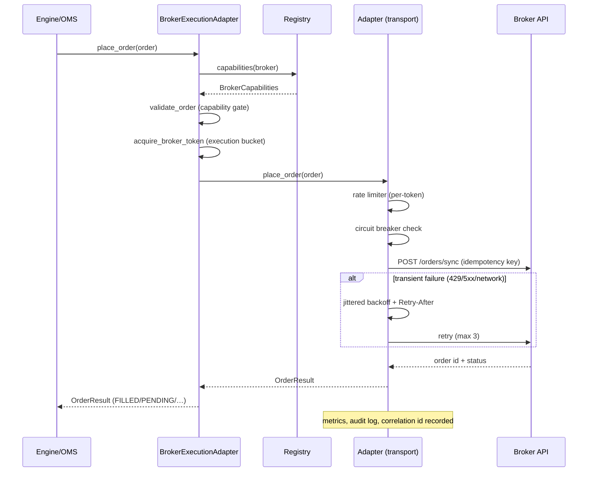
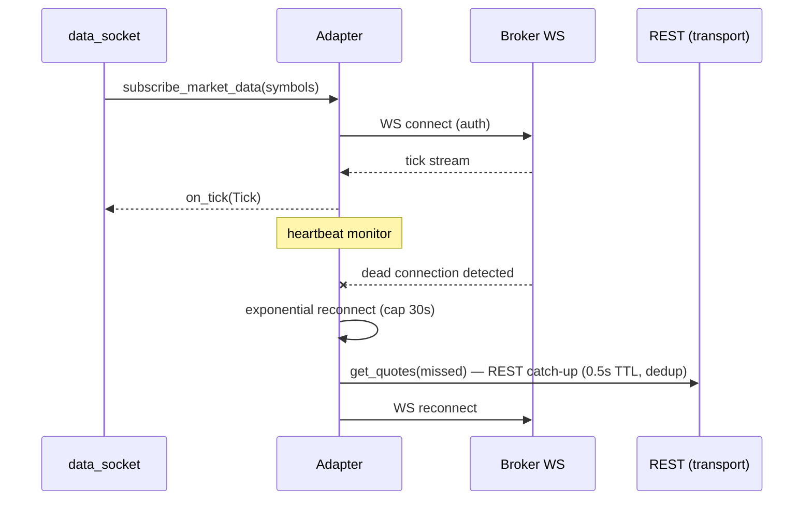
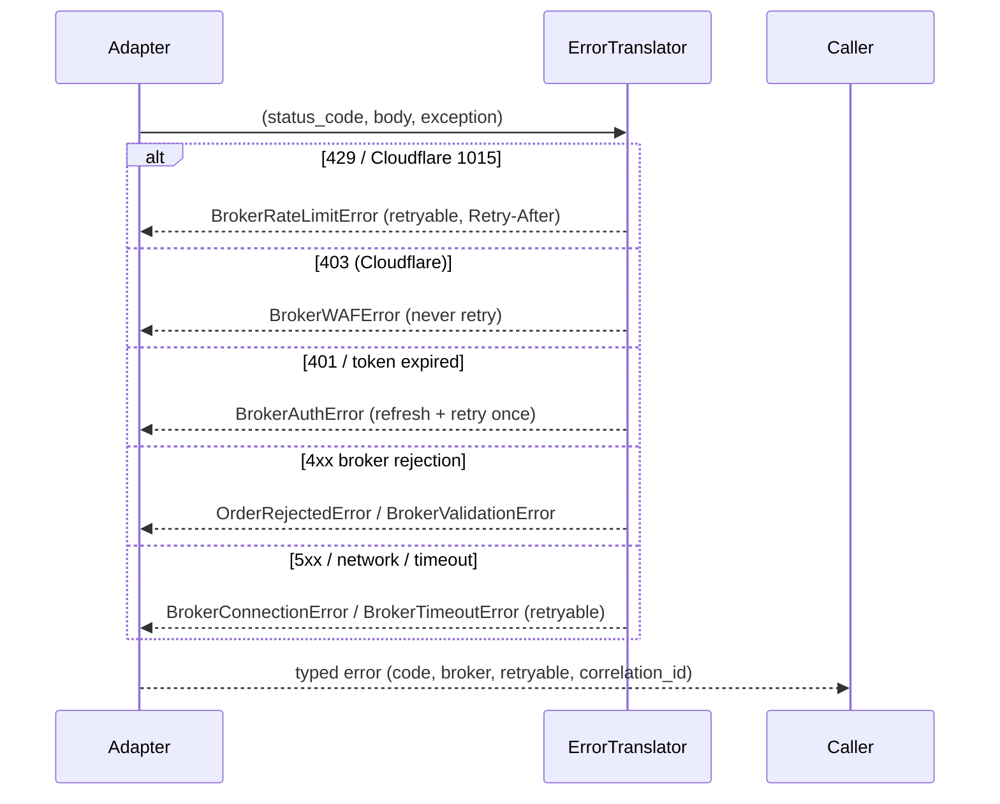

# Unified Broker SDK v2 — Enterprise Architecture

Status: PRODUCTION COMPLETE (Phases 1–4) · Owner: Platform Engineering · Target: real-money multi-broker trading
Broker SDK: **FROZEN** (2026-08-03) — no further architectural refactoring unless fixing production defects or adding a completely new broker.

## 1. Mission

One broker-agnostic interface for the entire application (engine, OMS, strategies, UI, backtests).
Adding or swapping a broker changes exactly one thing: the broker adapter registered in the
SDK registry. The trading engine must never know which broker is connected.

```
Engine / OMS / Strategies / UI / Backtest
                 │  (never touches broker code)
                 ▼
        BrokerExecutionAdapter (per-user facade)
                 │
                 ▼
   ┌────────────────────────────────────────────┐
   │           UNIFIED BROKER SDK v2            │
   │  interface ─ registry ─ factory ─ errors   │
   │  capabilities ─ transport ─ auth ─ ws      │
   │  rate limit ─ retry ─ circuit breaker      │
   │  health ─ metrics ─ audit ─ translation    │
   └────────────────────────────────────────────┘
                 │
                 ▼
       Broker Adapters (Fyers, Angel, Dhan, …)
```

## 2. Current state (audit, 2026-08-03)

| Concern | Status today |
|---|---|
| Adapter surface | `BaseBroker` ABC: authenticate, place/modify/cancel, orderbook, positions, holdings, funds, quotes, historical, stream, disconnect + margin estimate + unsubscribe; every adapter also exposes the v2 surface via `BrokerAdapterBase` |
| Adapters | fyers, angelone, dhan, zerodha, upstox, aliceblue, fivepaisa, finvasia, flattrade, kotakneo, groww (11) |
| Registry | `brokers/sdk/registry.py` single source of truth (adapter class + UI metadata + capabilities); legacy `create_broker`/`get_broker_metadata`/`BROKER_CAPABILITIES` delegate to it |
| Capabilities | authoritative matrix in `brokers/sdk/capabilities.py`; runtime discovery endpoint `GET /api/v1/brokers/capabilities` |
| Reliability | `core/resilience.py` CircuitBreaker + retry; `brokers/circuit_breaker_broker.py` wrapper; breaker state bridged to health + typed `CIRCUIT_OPEN` events |
| Transport | generic `brokers/sdk/transport.py` `HttpTransport` (sliding limiter, jittered backoff, Retry-After, WAF-aware, cache, dedup, correlation ids, Prometheus counters, health) with pluggable strategies; Fyers uses it via a thin facade |
| Errors | typed taxonomy in `brokers/sdk/errors.py` (`BrokerError` + WAF/auth/rate-limit/timeout/connection/validation/order-rejected) + `translate_broker_error` |
| Auth | `brokers/sdk/auth.py` unified token/session lifecycle (`ManagedSession`, single-flight refresh, re-auth state, `TokenStore`, `SessionManager` registry); Fyers provider in `fyers_provider.py` |
| WebSocket | `brokers/sdk/websocket.py` generic manager (reconnect/backoff, heartbeat + latency, subscribe dedup + resubscribe, routing, stats) |
| Health | `brokers/sdk/health.py` `BrokerHealthService` (component signals → canonical state); `GET /api/v1/brokers/health[/{broker}]` |
| Observability | `brokers/sdk/events.py` typed audit bus; `brokers/sdk/metrics.py` unified metrics registry; `core/prometheus.py` broker event/health/auth gauges; `GET /api/v1/brokers/metrics/{broker}`; `/health/metrics` `brokers` block |
| Certification | `brokers/sdk/certification.py` Level A interface + Level B behavioral certs (all 11 brokers CERTIFIED); `live_cert.py` live engine-workflow certification (`.json` + `.md` reports) |

Phase 4 completes the SDK roadmap; the remaining exception is a **validation
gap only** (not a code gap): see [Known gaps](#known-gaps).

## 3. Target architecture (Clean Architecture)

Layers (dependency rule: outer → inner only):

1. **Domain** — `core/models.py` (NormalizedOrder, OrderResult, Position, Holding, Funds, Quote, Candle, Tick, Session) — already broker-agnostic; unchanged.
2. **Application** — engine, OMS, strategies, backtest — depend on `BrokerExecutionAdapter`, never on adapters.
3. **Infrastructure / SDK** — `brokers/sdk/`:
   - `errors.py` — typed error taxonomy + error translator
   - `capabilities.py` — `Capability` enum + `BrokerCapabilities` (superset, backward-compatible) + authoritative matrix
   - `interface.py` — `BrokerPort` (v2 surface) + `BrokerAdapterBase` (compat adapter implementing v2 from BaseBroker)
   - `registry.py` — `BrokerRegistry` (single source of truth: adapter class + metadata + capabilities)
   - `transport.py` (Phase 2) — generic `HttpTransport` (rate limit, retry, dedup, cache, WAF) extracted from fyers_http
   - `auth.py` (Phase 3) — OAuth/token/session lifecycle abstraction
   - `websocket.py` (Phase 3) — unified WS client with reconnect/heartbeat
   - `health.py` (Phase 3) — per-broker health monitor, connection scoring, dead-connection detection
   - `audit.py` (Phase 3) — per-call broker audit trail
4. **Adapters** — one file per broker implementing `BaseBroker` (transport-backed), registered in the registry.

### Required v2 method surface (every adapter exposes these)

`connect()` · `disconnect()` · `refresh_token()` · `get_profile()` · `get_funds()` ·
`get_holdings()` · `get_positions()` · `get_orders()` · `place_order()` · `modify_order()` ·
`cancel_order()` · `exit_position()` · `get_quotes()` · `get_option_chain()` ·
`get_historical_data()` · `subscribe_market_data()` · `unsubscribe_market_data()` · `health()` · `capabilities()`

Backward compatibility: `BrokerAdapterBase` implements the v2 names in terms of the existing
`BaseBroker` methods (`get_orders → get_orderbook`, `get_historical_data → get_historical`,
`subscribe_market_data → stream`, etc.). Anything without a base implementation raises
`UnsupportedFeatureError` instead of failing unpredictably.

## 4. Capability matrix (authoritative, `brokers/sdk/capabilities.py`)

`✓` = supported · `–` = `UnsupportedFeatureError` (never an unpredictable failure)

| Capability | fyers | angelone | dhan | zerodha | upstox | aliceblue | finvasia | flattrade | fivepaisa | kotakneo |
|---|---|---|---|---|---|---|---|---|---|---|
| Orders | ✓ | ✓ | ✓ | ✓ | ✓ | ✓ | ✓ | ✓ | ✓ | ✓ |
| Order modification | ✓ | ✓ | ✓ | ✓ | ✓ | ✓ | ✓ | ✓ | ✓ | ✓ |
| Order cancellation | ✓ | ✓ | ✓ | ✓ | ✓ | ✓ | ✓ | ✓ | ✓ | ✓ |
| Bracket orders | ✓ | ✓ | – | ✓ | ✓ | – | – | – | – | ✓ |
| Cover orders | – | ✓ | – | ✓ | ✓ | – | – | – | – | – |
| GTT | – | ✓ | ✓ | ✓ | ✓ | – | – | – | – | ✓ |
| Multi-leg orders | – | ✓ | – | – | – | – | – | – | – | – |
| Option chain | ✓ | – | – | – | – | – | – | – | – | – |
| Historical data | ✓ | ✓ | ✓ | ✓ | ✓ | ✓ | ✓ | ✓ | ✓ | ✓ |
| WebSocket | ✓ | ✓ | ✓ | – | ✓ | ✓ | ✓ | ✓ | – | ✓ |
| Market depth | – | ✓ | ✓ | – | ✓ | – | – | – | – | – |
| Greeks | – | – | – | – | – | – | – | – | – | – |
| Indices | ✓ | ✓ | ✓ | ✓ | ✓ | ✓ | ✓ | ✓ | ✓ | ✓ |
| Currency | ✓ | – | – | – | – | – | – | – | – | – |
| Commodity | – | – | – | – | – | – | – | – | – | – |
| Margin calculator | ✓ | – | – | – | – | – | – | – | – | – |
| Quotes | ✓ | ✓ | ✓ | ✓ | ✓ | ✓ | ✓ | ✓ | ✓ | ✓ |
| Positions | ✓ | ✓ | ✓ | ✓ | ✓ | ✓ | ✓ | ✓ | ✓ | ✓ |
| Holdings | ✓ | ✓ | ✓ | ✓ | ✓ | ✓ | ✓ | ✓ | ✓ | ✓ |

Derived from the production-proven static matrix (`execution/broker_adapter.py`) + Fyers
verification; adjust only with evidence from certification runs.

## 5. Reliability engine (unified pipeline)

Every transport request passes through, in order:

```
caller → [capability gate] → [sliding rate limiter] → [dedup/in-flight merge] → [cache read]
      → [circuit breaker] → [wire call] → [error translator] → [retry w/ Retry-After + jitter]
      → [metrics + audit + correlation id]
```

Rules: writes never auto-retry (place/modify/cancel) · 403 (WAF) never retries · 429/1015 honors
`Retry-After` else jittered backoff (base 0.25s cap 8s) · 5xx retried (max 3) · 4xx translated to
typed errors, never retried · order submission idempotency via client-order-id where the broker
supports it (Dhan request_id, Fyers orderTag) · duplicate request prevention via in-flight merging.

## 6. Sequence diagrams

### 6.1 Connect + place order (engine → broker, broker-agnostic)



### 6.2 Market data (WS preferred, REST fallback)



### 6.3 Error translation



## 7. Observability (Phases 3–4, done)

Prometheus (new broker_* metrics): `broker_requests_total{broker,operation,status}`,
`broker_request_duration_ms{broker,operation}`, `broker_rpm_usage{broker,client}`,
`broker_reconnects_total{broker}`, `broker_uptime_seconds{broker}`, `broker_circuit_state{broker}`,
`broker_ws_*{broker}` (connected, messages, missed), `broker_order_latency_ms{broker,type}` +
`broker_events_total{broker,kind}`, `broker_health_state{broker}`, `broker_auth_state{broker}`
(v1.3.1). Health: `/brokers/admin/rate-limit` (Fyers), `/api/v1/brokers/health[/{broker}]` (all),
per-broker health payload with auth/rest/ws/circuit/rate/caps + `reported_at`. Every broker call
logs one structured line with correlation id: `broker.call {broker, operation, status, latency_ms, retries, cached, dedup, correlation_id}`; audit events fan out through `events.py` (structured log + prometheus + health bridge).

## 8. Phased roadmap (all phases green: `pytest tests/` + deploy)

| Phase | Scope | Status |
|---|---|---|
| **1** — Foundation (done 2026-08-03) | `brokers/sdk/`: errors, capabilities matrix, registry, interface; wire execution layer + UI metadata to registry | **PRODUCTION COMPLETE** — 644 passed; typed-error tests; cert 11/11 |
| **2** — Transport (done 2026-08-03) | Generalize transport: `brokers/sdk/transport.py` `HttpTransport` extracted from `fyers_http.py` (rate limit, retry, dedup, cache, WAF, correlation ids, metrics, health); Fyers uses it via thin facade; before/after benchmark | **PRODUCTION COMPLETE** — 662 passed; `docs/BrokerTransportBenchmark.md` |
| **3** — Infrastructure (done 2026-08-03) | Auth layer (`auth.py` token/session lifecycle), WS layer (`websocket.py`), health monitor (`health.py`), audit event bus (`events.py`), error-translator adoption | **PRODUCTION COMPLETE** — 690 passed incl. `test_sdk_phase3.py` |
| **4** — Observability + live cert (done 2026-08-03) | Unified metrics surface (`metrics.py`, `observability.py`, `fyers_provider.py` glue); broker health/metrics/capabilities endpoints; live certification framework (`live_cert`) + CLI | **PRODUCTION COMPLETE** — 715 passed incl. `test_sdk_phase4.py` + `test_sdk_live_cert.py` |
| **5** — Live cred-backed certification per broker | Run the live cert framework on demand with fresh credentials per broker (fyers first; others as creds become available) | Fyers first-run documented in `docs/evolution/certs/`; other brokers pending real credentials (Known gaps) |
| **6** — Performance | Thousands of users — transport sharing audit, cache hit-rate, WS-first enforcement, memory profile | `docs/BrokerBenchmarks.md` (deferred — no current need; re-open under freeze exception) |

New broker onboarding (now that Phases 1–4 are production-complete) = write one adapter file + one
registry entry + one auth provider + run the cert suite + live certification. **Per the freeze
(2026-08-03): do not refactor SDK internals without a production defect or a new broker.**

## 9. Migration plan (zero breakage)

1. **Phase 1 additive only**: `brokers/sdk/` is new; no existing file's behavior changes.
2. Execution layer capabilities re-pointed to SDK matrix (same values; verified by tests).
3. `brokers/registry.py` metadata re-pointed to SDK registry (same payload).
4. Adapters keep `BaseBroker`; v2 method names added via `BrokerAdapterBase` mixin as aliases —
   old callers untouched.
5. Engine/OMS continue via `BrokerExecutionAdapter` (already broker-agnostic).
6. Transport generalization (Phase 2) behind the same `get_transport()` entry point — Fyers
   callers unchanged.
7. Each phase deployed via `deploy.sh`; feature-flag nothing — additive code only.

## 10. Rollback strategy

- Every phase is additive: removing it = revert the commit(s). No data migration is required.
- Transport/registry entry points return to previous behavior by reverting the wiring commit
  (`execution/broker_adapter.py`, `brokers/__init__.py`).
- Capabilities: if a capability flag is later found wrong, flip the single matrix cell and
  re-run cert — no code change in consumers.
- Live trading risk: order-path behavior is unchanged in Phases 1–3 (writes still retries=0,
  idempotency keys as today); only observability and typed errors change.
- Backup snapshot before each deploy (`infra/scripts/backup.sh`) + git revert + redeploy is the
  documented DR path (see `DISASTER_RECOVERY.md`).

## 11. Phase 2 — generic `HttpTransport` (done 2026-08-03)

### Design decisions

1. **Generic core, broker facade.** `brokers/sdk/transport.py` owns every piece of
   machinery with **zero broker-specific logic** (enforced by
   `test_transport_has_no_broker_specific_logic` — no broker names, no
   `broker == ...` branches). `brokers/fyers_http.py` is now a thin facade
   supplying `TransportConfig` (budgets, hosts, retry knobs) + strategy
   overrides; its public API is byte-for-byte the same
   (`FyersTransport`, `FyersResponse`, `FyersWAFError`, `TokenRateLimiter`,
   `get_transport`, `fyers_rate_snapshot`) so all 7 consumer sites were
   untouched.
2. **Strategy extension points** (per the Phase-2 mandate, no `if broker`):
   - `AuthStrategy` — `authorization()` header + `sign()` hook for HMAC-style
     signing (Fyers: `{client_id}:{access_token}`).
   - `HeaderStrategy` — static header set + Content-Type logic (Fyers:
     browser-identical headers for Cloudflare).
   - `URLBuilder` — path → absolute URL + stats stub (Fyers: `api-t1.fyers.in`
     + `public.fyers.in` CSV stubs, preserving legacy stats keys).
   - `ResponseParser` — raw client response → `TransportResponse`.
   - `ErrorTranslator` — status → typed `BrokerError` (Fyers: 403 →
     `FyersWAFError`, which now also subclasses SDK `BrokerWAFError`).
   - `RetryPolicy` — retryable statuses, Retry-After, jittered backoff.
   - `RateLimiter` (a.k.a. `TokenRateLimiter`) — the rate-limit policy
     (sliding window + burst), byte-identical to the pre-refactor limiter.
3. **New capabilities**: per-request `correlation_id` (defaults to a uuid,
   logged as `corr=` on every `request`/`retry`/`waf` record), `health()`
   (liveness + latency + last error), Prometheus counters
   (`broker_http_calls/wire_calls/cache_hits/dedup_hits/retries/
   rate_limited/waf_blocks/failures_total` + `broker_http_latency_seconds`),
   and `waf_statuses`/`rate_limit_statuses`/`retryable_http` config sets.
4. **Shared pools preserved**: one transport + one limiter per `client_id`
   via the facade registry — all adapter/caller instances for a token share
   the connection pool and RPM ledger.
5. **Verification**: full regression **662 passed, 1 xfailed** (baseline 644);
   before/after benchmark (identical canned workload vs git HEAD) shows **Δ = 0
   on every accounting counter** (calls/wire/cache/dedup/retries/rate-limited/
   WAF/failures) and ~+0.09 ms + ~63 B per request from correlation-id +
   metric emission — see `docs/BrokerTransportBenchmark.md`.
6. **Test-only change**: two `asyncio.sleep` patch targets moved from
   `brokers.fyers_http` to `brokers.sdk.transport` (where sleep now executes).

### Onboarding another broker (post-Phase 4)

```python
from brokers.sdk.transport import HttpTransport, TransportConfig

config = TransportConfig(broker="acme", base_url="https://api.acme.in",
                         rpm=60, burst=5, impersonate="chrome131",
                         log_prefix="acme")
class AcmeAuth(AuthStrategy): ...   # tokens/signing
class AcmeHeaders(HeaderStrategy): ...
class AcmeURL(URLBuilder): ...
class AcmeErrors(ErrorTranslator): ...  # status -> BrokerError subclasses
transport = HttpTransport(config, client_id=cid, access_token=tok,
                          auth=AcmeAuth(), headers=AcmeHeaders(),
                          url_builder=AcmeURL(), translator=AcmeErrors())
```

No machinery changes required — the transport never branches on broker.

## 12. Phases 3 & 4 — builder blocks + observability + live certification (done 2026-08-03)

### Phase 3 — reusable infrastructure

| Module | Responsibility |
|---|---|
| `events.py` | Typed `BrokerEventKind` audit bus — sequence-numbered fan-out to sinks, `LoggingSink` (structured `event=` lines), `MetricsSink` → `broker_events_total`, ring buffer, health bridge (state transitions emit `HEALTH_CHANGED`) |
| `auth.py` | `Token`/`TokenStore`/`ManagedSession`/`SessionManager`/`AuthProvider` — expiry detection (5-min buffer), single-flight refresh, re-auth state, per-account registry, `session.health()` |
| `websocket.py` | generic `WebSocketManager` (backend-factory pattern) — reconnect/backoff (cap 60s), heartbeats + latency, subscription dedup + resubscribe, message routing, stats |
| `health.py` | `BrokerHealthService` — REST/WS/auth/rate-limit/circuit/degraded signals → canonical `BrokerHealthState` after components |

### Phase 4 — Observability + live certification

- **`metrics.py`** — one metrics contract (`requests/success/failure/retry`, breaker, WS, auth, token-refresh, latency, cache/dedup ratio, rate-limit utilisation) exposed as a flat snapshot.
- **`observability.py`** — `TransportMetricSource` adapts `HttpTransport`s live snapshot to the metrics contract; `wire_default_observability()` composes bus → health → metrics at app start; `breaker_state_bridge()` forwarding circuit-breaker state into health + events + prometheus.
- **`fyers_provider.py`** — Fyers `AuthProvider` + `register_fyers_observability` (real transport snapshot into default registry).
- **Endpoints** — `GET /api/v1/brokers/health[/{broker}]`, `/metrics/{broker}`, `/capabilities` (all auth-required, unknown broker → 404); `/health/metrics` `brokers` block.
- **Live certification** — `brokers/sdk/live_cert.py` (`LIVE_STEPS`, `run_live_certification`, `LiveCertResult`, `write_report` → `.json` + `.md`) + `brokers/live_cert.py` CLI. `allow_orders=True` gates the destructive place/modify/cancel steps. Each step has a timeout; completed-without-exception (incl. `None` from fire-and-forget) counts as pass.

### Phase 4 verification
- `pytest tests/` → **715 passed, 1 xfailed** (662 baseline + 53 new).
- Live cert framework unit-tested end-to-end with fake adapters (healthy adapter certifies, broken/expired-token adapters invalidate, opt-in order steps, per-step timeouts, JSON+MD report emission).
- Refer `CHANGELOG` v1.3.1 for the full change list.

### Known Gaps

1. **Fyers `get_option_chain` — live certification not yet run on a real token.** The adapter exposes the v2 surface (`BrokerAdapterBase`), the capability matrix marks `option_chain` ✓, the platform option-chain route is backed by the transport (10s TTL, WAF-aware), and `option_chain` is a live step in `LIVE_STEPS`. What's pending is one credential-backed live-cert run that actually exercises Fyers' option-chain endpoint through the SDK (a validation gap, not a code defect). Tracked here until a run exists under `docs/evolution/certs/`.
2. **Live cred-backed certification for angelone / dhan / zerodha / upstox / aliceblue / fivepaisa / finvasia / flattrade / kotakneo / groww** — the SDK+cert framework is ready; running it requires active broker credentials per broker (fyers-first documented; others when creds are available).
3. **Per-call broker audit logger** (Phase-3 design listed `audit.py`) — superseded by the event bus (`events.py`) so every call can publish to `broker.call`; a durable store for those events is not yet built. Re-open under the freeze exception only for a production defect.
