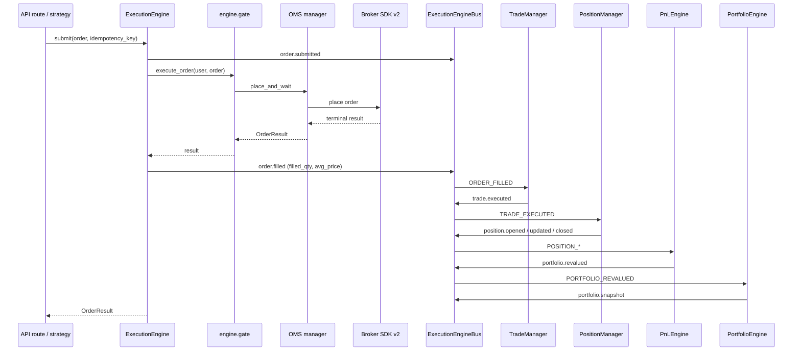
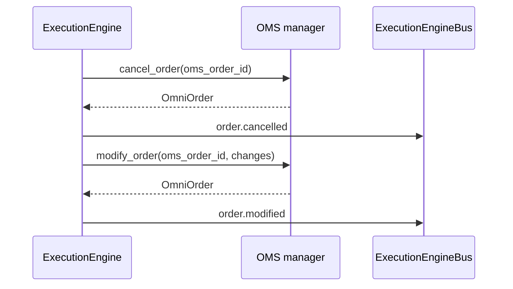

# Execution Engine v1.0 — Architecture

> Status: **BUILD COMPLETE** (2026-08-03) · Package: `apps/api/execution_engine/`
> Approach: **Compose + fill gaps** — formalizes the existing OMS → Execution →
> Paper → Portfolio → Risk stack under one canonical, event-driven execution
> layer. The Broker SDK v2 remains **frozen**; no broker architecture changes.

## 1. Position in the stack

```
 Strategy / API route
      │  NormalizedOrder (core.models)
      ▼
 ┌──────────────────────────────────────────────┐
 │            ExecutionEngine facade            │  execution_engine/engine.py
 │  submit / cancel / modify, idempotency keys  │
 └──────────────────────────────────────────────┘
      │  execute_order via engine.gate (OMS path)
      ▼
 ┌──────────────────────────────────────────────┐
 │   OMS → Redis queue → ExecutionManager       │  existing production stack
 │   → Broker SDK v2 (frozen) → broker          │
 └──────────────────────────────────────────────┘
      │  terminal fill / rejection / pending
      ▼
 ┌──────────────────────────────────────────────┐
 │        ExecutionEngineBus (canonical)        │  execution_engine/events.py
 │  order.* → trade.* → position.* → portfolio.*│
 └──────────────────────────────────────────────┘
      │            │              │
      ▼            ▼              ▼
 TradeManager   PositionManager  PnLEngine ──► PortfolioEngine ──► metrics/logs
```

The engine is the **single event spine**: every meaningful lifecycle event
crosses one typed, thread-safe, async-first domain bus (`ExecutionEngineBus`),
so consumers (fills ledger, net positions, P&L, portfolio snapshots,
Prometheus) never couple to producers (OMS, paper broker, broker SDK).

## 2. Canonical event model (`events.py`)

- 6 domains: `order`, `execution`, `trade`, `position`, `portfolio`, `risk`.
- 24 typed events (`ExecutionEventType`) — e.g. `order.submitted` →
  `order.filled` → `trade.executed` → `position.opened` → `portfolio.revalued`
  → `portfolio.snapshot`.
- One `ExecutionEngineEvent` pydantic model: sequence id (assigned under lock
  at publish), `correlation_id` (inherited or derived from client order id),
  `occurred_at`, user/broker/account, symbol/side/qty/price/fill state, and a
  free-form `payload`.
- **Thread-safe publish**: started bus marshals cross-thread publishes via
  `call_soon_threadsafe`; a single async dispatcher awaits coroutine handlers
  in FIFO order → deterministic per-key ordering.
- **Pre-startup inline dispatch** (`apublish`): dispatches synchronously and
  drains any fire-and-forget cascade tasks spawned by handlers, so
  `await apublish(...)` implies the whole downstream chain has run.
- Ring buffer (2000) of recent events for debugging/analytics
  (`bus.recent(limit)`).
- `bridge_legacy_events()` forwards the legacy string-typed
  `execution.event_bus` producers (`RiskDecision`, `OrderRejected`,
  `OrderPending`, `OrderFilled`, `OrderCancelled`, `OrderExpired`) into the
  canonical bus with zero changes to legacy producers.

## 3. Canonical state machine (`state_machine.py`)

One authoritative superset merging the OMS + Execution transition tables,
plus the infrastructure-lifetime `FAILED` state:

```
NEW → VALIDATED → QUEUED → SENT → PENDING → PARTIALLY_FILLED → FILLED
  └────────┴─────────┴──────┴────────┴──────────┴────── REJECTED / CANCELLED / EXPIRED / FAILED (terminal)
```

- `PARTIAL` accepted as a legacy alias for `PARTIALLY_FILLED`
  (`normalize()`).
- `TERMINAL_STATES` / `ACTIVE_STATES` helpers; `OrderStateMachine`
  validates every transition (illegal ones are rejected, never applied).

## 4. Fills → P&L chain

```
ORDER_FILLED ──► TradeManager ──► trade.executed ──► PositionManager ──► position.opened/updated/closed
                                                                          │
                                   portfolio.snapshot ◄── PortfolioEngine ◄── portfolio.revalued ◄── PnLEngine
```

1. **TradeManager** (`trades.py`) — records every fill as a `TradeRecord` in a
   thread-safe, per-account-capped in-memory ledger (optional `TradeStore`
   protocol for durable persistence later). Publishes `trade.executed`.
2. **PositionManager** (`positions.py`) — consumes `trade.executed`, applies
   each fill through a per-symbol `FifoLots` engine, maintains signed net
   quantity, VWAP average prices, realised/unrealised P&L and
   mark-to-market. Publishes `position.opened/updated/closed`.
3. **PnLEngine** (`pnl.py`) — recomputes per-account totals (realised,
   unrealised, daily P&L over an IST day window, equity, peak, drawdown)
   from PositionManager state — **recompute, never accumulate** → no drift by
   construction. Publishes `portfolio.revalued` (with `open_positions`).
4. **PortfolioEngine** (`portfolio_engine.py`) — rebuilds a full portfolio
   snapshot per user (brokers, positions, P&L, equity) from the P&L engine and
   publishes `portfolio.snapshot`. Optional `SnapshotStore` protocol for
   persistence. Never reacts to its own snapshots (no self-trigger loops).
5. **Legacy composition** — `portfolio/manager.py` `refresh()` now mirrors
   broker-truth state onto the canonical bus as a `portfolio.snapshot`
   (`source: portfolio_manager`) so engine consumers see broker-synced
   positions/funds/PnL (additive, fail-open).

### FIFO realized P&L (`fifo.py`)

FIFO lot engine (matches Indian broker defaults and the historical
`risk/helpers.py` math, but in-memory, thread-safe and event-driven):

- `apply(side, qty, price)` → realized P&L of the fill (positive = profit);
  closing below entry realizes a loss, closing above realizes a profit on both
  long and short legs.
- Reversal fills (closing more than the open) automatically open a lot on the
  opposite side.
- Validated: buy 65@71.75 + 35@70.25 → sell 40@73 (+50) → sell 60@74.5
  (+217.5) = **267.5 total realized**.

## 5. Facade (`engine.py`)

`ExecutionEngine` is the single user-facing entry point:

- `submit(user_id, order, source=..., idempotency_key=...)` — publishes
  `order.submitted`, routes through the gateway (default:
  `engine.gate.execute_order`, the OMS/Redis/audit path), then publishes the
  outcome event (`order.filled` / `partially_filled` / `pending` / `rejected`
  / `failed`) plus `execution.result`. `duplicate` results are silent
  (idempotent). Any exception → `order.failed` + `OrderResult(status="error")`.
- `cancel()` / `modify()` delegate to the OMS manager and publish
  `order.cancelled` / `order.modified`.
- Gateway injectable → fully unit-testable without a broker or DB.

## 6. Metrics (`metrics.py`)

Prometheus sink subscribed to order/trade/risk/portfolio domains:

- Order lifecycle counters per event type; per-broker filled / partial /
  rejected / cancelled / failed counters; pending gauge.
- `execution_engine_trades_executed_total`, `execution_engine_risk_decisions_total`.
- Per-broker account gauges: realized/unrealized/daily PnL, equity, drawdown
  % (from `portfolio.revalued`) and `open_positions` (from revalued +
  snapshot events).

## 7. Bootstrap (`init.py`)

`init_execution_engine(loop)` (called from `main.py` lifespan after
`order_manager.start()`):

- wires the chain: `PnLEngine._positions = PositionManager`,
  `PortfolioEngine._positions = PositionManager`, `PortfolioEngine._pnl = PnLEngine`;
- installs all managers + metrics + legacy bridge;
- starts the bus on the running loop (falls back to inline dispatch);
- returns an introspection registry. `shutdown_execution_engine()` drains and
  stops the bus. `reset_execution_engine()` is a test hook.

## 8. Sequencing





## 9. Design guarantees

| Property | How |
|---|---|
| No race conditions | per-structure locks; single async dispatcher; thread-safe marshalled publishes |
| Deterministic ordering | FIFO dispatcher, per-key correlation ids |
| No drift | engines recompute from PositionManager state, never accumulate |
| No infinite loops | `PortfolioEngine` ignores its own `portfolio.snapshot`; `_finalize` is idempotent |
| Idempotency | `submit` honors `idempotency_key` → `duplicate` results are silent |
| Multi-account/multi-broker | every state key is `(user_id, broker[, symbol])` |
| Failure isolation | all handlers/logging fail-open; bus never crashes producers |
| Legacy compatibility | canonical machine accepts `PARTIAL`; legacy bus bridged; legacy manager mirrors snapshots |

## 10. Tests

`tests/test_execution_engine.py` — 40 tests across: state machine
(normalize/aliases/transitions), FIFO (sign correctness, ordering, reversals,
unrealized), bus (inline dispatch, sequences, ring buffer, async handlers,
thread-safety, ordering), TradeManager (ledger, zero-price skip, durable
store, totals), PositionManager (open/update/close lifecycle, shorts, MTM,
aggregates), PnL/Portfolio chain (267.5 round-trip, equity peak/drawdown,
no-self-trigger regression), facade (all outcome statuses, cancel/modify
delegation), metrics (counters/gauges) and bootstrap (idempotent init,
start/stop). Full regression: **756 passed, 1 xfailed**.
